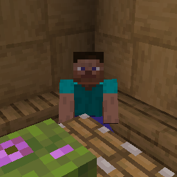

# Polysit

A polymer-based server-side sit mod for Fabric & Quilt!

## Installation

Requirements:

- Minecraft 1.19.3 through 1.21.4
- [Polymer]
- [Polysit]
- Pick a mod loader:
    - [Quilt](https://quiltmc.org/install) + [QSL](https://modrinth.com/mod/qsl)
    - [Fabric](https://fabricmc.net/use) + [Fabric API](https://modrinth.com/mod/fabric-api)

Install Minecraft, [Polymer], [Polysit] and your mod loader of choice.
You only need to install it on the server, but there's a client-sided enhancement if one prefers.

You also have the option of using it in singleplayer or with friends over LAN.

## Using

You can right-click/use any slab, stair and bed to sit on it.

There's also `/sit`, which allows you to sit practically anywhere, even on cacti... if you're immune to thorns.

For clients with the mod, there's also a keybind named `Sit`, which defaults to `G`.
It'll similarly let you sit anywhere, if the server is running Polysit.

> [!NOTE]
> Servers using other mods or plugins that happen to also include `/sit` as a command,
> or using an older version of Polysit, may not use the same checks or be as seamless as the latest version.
>
> If the server does not support or blocks `/sit`, this keybind may be unavailable and cannot be used.
>
> Unfortunately, this is unavoidable as the only method Polysit uses on the client is the `/sit` command.

## Compatibility

It is compatible with any mod that implements standard slabs, stairs and beds.
It's even compatible with the scale attribute, and other scaling mods such as Pehkui.

> [!NOTE]
> 1.20.1 and older has poorer support for Pehkui.
> Bugs in relation to scaling while sitting will occur.
> There are still [mitigations](#changes-to-vanilla-logic) for Polysit's other behaviours.  

If for any reason, there's a slab, stair, bed, or any other seat-like block that doesn't work,
[feel free to submit a bug report](https://github.com/Modflower/Polysit/issues/).

### Changes to Vanilla Logic

Polysit does try to fix bugs that were found in development, or directly caused by its functionality.

- Moving the player out of blocks when getting up.
- Forcing the player to take a smaller pose to avoid suffocating when getting off a seat.
  - This applies generically to any seat, not just Polysit's.
- Forcefully sending relevant packets for bugs caused by Mojang's fixes or changes.
- Beds during the day can be right-clicked to sit on it.

All help to ensure that Polysit provides the best UX it possibly can while also maintaining vanilla-esk logic.

## Building

1. Make sure you have the JDK.
   You can get it from [Adoptium](https://adoptium.net) if you don't already have it.
   Java 17 is required for <=1.20.4.
   Java 21 is required for >=1.20.5.
2. Run `gradlew build`
3. Get the build from `builds/libs`.

[Polymer]: https://modrinth.com/mod/polymer

[Polysit]: https://modrinth.com/mod/polysit